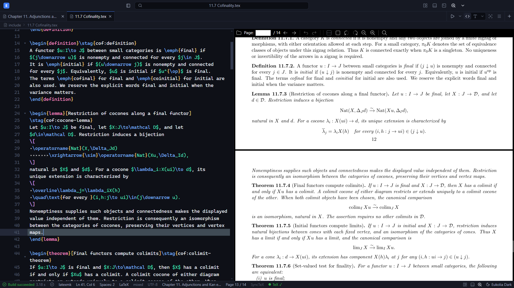
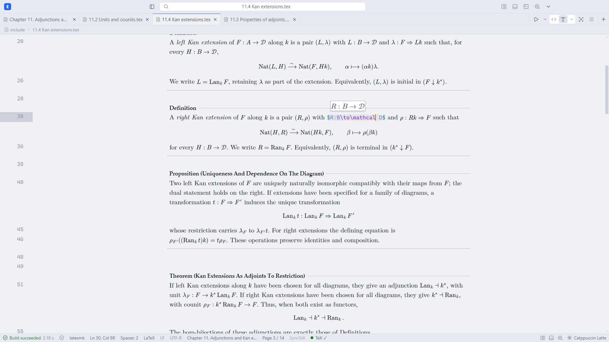
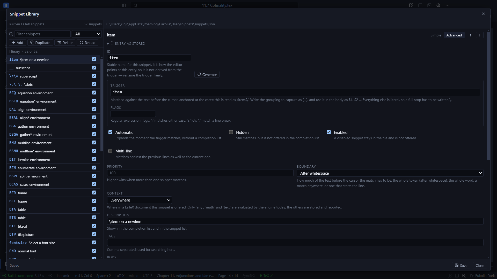

# Eukolia

**A fast, modern, and free LaTeX editor with visual editing, powerful snippets, and a built-in PDF viewer.**

Eukolia is a desktop LaTeX editing application designed to provide a modern, responsive, and flexible writing environment for students, researchers, writers, and anyone who works with LaTeX.

> **Eukolia is currently in alpha.** The application is under active development, and some features, interfaces, and behavior may change significantly between releases.

## ✨ Features

### Visual Editing

Write and edit LaTeX in a more visually intuitive environment while preserving the underlying LaTeX source.

### Focus Mode

A distraction-reduced editing mode designed for concentrated writing.

### Powerful Snippets

Speed up repetitive LaTeX input with flexible and customizable snippets. Snippets are fully supported in both Code Mode and Visual Mode.

For details on creating, configuring, and using snippets, see [**SNIPPETS.md**](SNIPPETS.md). 

### Built-in PDF Viewer

Compile and inspect your document without leaving the application.

### Flexible Settings

Customize the editor and its behavior to better fit your workflow.

## 📦 Installation

Download the latest release from:

**https://github.com/lmxf-11/eukolia/releases**

### Installer

Download `Eukolia.Setup.0.1.0.exe` and run the setup wizard.

### Portable

Download `Eukolia-0.1.0.zip`, extract the archive and run: `Eukolia.exe`.

## ⚠️ Alpha Status

Eukolia is still at an early stage of development and is currently intended primarily for testing and experimentation.

Some known limitations include:

* The UI has not yet been fully optimized.
* Scrolling in the visual editor may occasionally stutter or feel laggy.
* Switching to focus mode may reduce some visual-editor scrolling issues.
* Mouse scrolling in the PDF viewer currently has a relatively low frame rate. Improving PDF rendering and scrolling performance is a development priority.
* The mathematical symbols panel has not yet been implemented.
* Bugs and incomplete features should be expected.

If you encounter a problem, please report it so that it can be investigated and improved.

## 🛠️ Development

Eukolia is under active development.

Current areas of development include:

* Visual editor performance and rendering
* Smooth scrolling
* PDF viewer performance
* Snippet infrastructure
* Editing workflows
* Mathematical symbol insertion
* UI and UX improvements
* Performance optimization
* Bug fixes
* Additional customization options

The long-term goal is to make Eukolia a powerful and polished LaTeX environment while keeping it completely free to use.

## 💬 Feedback & Feature Requests

Feedback is especially valuable during the alpha stage.

If you encounter a bug, have an idea for an improvement, or would like to request a feature, please open an issue:

**https://github.com/lmxf-11/eukolia/issues**

When reporting a bug, it is helpful to include:

* What you expected to happen
* What actually happened
* Steps to reproduce the problem
* Your Eukolia version
* Your operating system
* Screenshots or recordings, when relevant

## 🤝 Contributing

Eukolia is still evolving rapidly, and contributions, testing, bug reports, ideas, and technical feedback are welcome.

If you would like to contribute, feel free to open an issue to discuss an idea, bug, or proposed improvement.

## ☕ Support Eukolia

Eukolia is completely free, and I intend to keep it that way.

If you enjoy using Eukolia and would like to help support its continued development, you can [**support the project here**](https://buymeacoffee.com/lmxf).

Support is entirely optional. Trying Eukolia, reporting bugs, suggesting improvements, contributing code, or simply sharing the project also helps enormously.

## ⭐ Follow the Project

If you would like to follow Eukolia's development or be notified about future releases, you can watch or star the repository:

[**https://github.com/lmxf-11/eukolia**](https://github.com/lmxf-11/eukolia)

## 📸 Preview (alpha)

---

  

  <strong>Eukolia</strong> 
  A modern environment for writing LaTeX.

