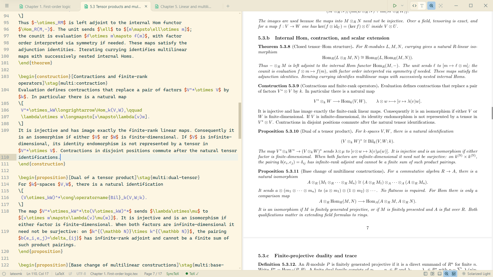

## 📦 Installation

Download the latest release from: [**https://github.com/lmxf-11/eukolia/releases**](https://github.com/lmxf-11/eukolia/releases)

### Installer

Download `Eukolia.Setup.0.5.0.exe` and run the setup wizard.

### Portable

Download `Eukolia-0.5.0.zip`, extract the archive, and run `Eukolia.exe`.

## 📚 Documentation & Configuration

Start by choosing or creating a **Library** to store your projects. Eukolia stores your settings, snippets, macros, and templates in the `.eukolia` subfolder inside your Library directory.

Instructions for using and creating snippets are available in [`SNIPPETS.md`](SNIPPETS.md).

Instructions for building LaTeX projects in Eukolia are available in [`BUILD.md`](BUILD.md).

My personal Eukolia settings, macros, snippets, and templates are included in the [`.eukolia`](.eukolia) directory of this repository. Feel free to use, modify, or adapt them for your own setup.

## 💬 Feedback & Feature Requests

Eukolia is still at an early stage of development and is currently intended primarily for testing and experimentation.

Feedback is especially valuable during this stage. If you encounter a bug, have an idea for an improvement, or would like to request a feature, please open an issue: **[https://github.com/lmxf-11/eukolia/issues](https://github.com/lmxf-11/eukolia/issues)**

## ☕ Support Eukolia

If you enjoy using Eukolia and would like to support its continued development, you can [**support the project here**](https://buymeacoffee.com/lmxf).

Support is entirely optional. Trying Eukolia, reporting bugs, suggesting improvements, contributing code, or simply sharing the project also helps enormously.

---

  

  <strong>Eukolia</strong> 
  A modern environment for writing LaTeX.

